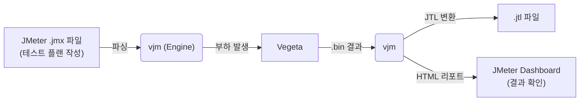

<p align="center">
  
</p>

<h1 align="center">⚡ vjm — Vegeta-JMeter Engine</h1>

<p align="center">
  <b>JMeter 테스트 플랜으로 Vegeta의 성능을 그대로 활용하세요.</b><br>
  Write with JMeter. Attack with Vegeta. Report with JMeter.
</p>

<p align="center">
  <a href="https://github.com/xvlet/vjm"></a>
  <a href="https://github.com/xvlet/vjm/blob/main/LICENSE"></a>
  
  
  
</p>

---

## 개요

**vjm**은 [Apache JMeter](https://jmeter.apache.org/)의 `.jmx` 테스트 플랜과 리포팅 기능을 그대로 활용하면서, 실제 HTTP 부하 발생은 Go 기반의 고성능 도구인 [Vegeta](https://github.com/tsenart/vegeta)를 통해 수행하는 **브릿지 엔진**입니다.

JMeter는 강력한 테스트 시나리오 작성 도구이지만 JVM 기반 특성상 대규모 동시 접속에서 성능 한계가 있습니다. vjm은 이 한계를 넘어, JMeter의 풍부한 생태계(GUI, 함수, 리포트)를 보존하면서 수천 TPS 이상의 부하를 안정적으로 발생시킵니다.



---

## 주요 기능

<table>
<tr><td><b>JMX 파싱</b></td><td>JMeter <code>.jmx</code> 파일의 HTTPSamplerProxy, HeaderManager, ThreadGroup, UserDefinedVariables, UserParameters, HTTP Request Defaults(ConfigTestElement) 파싱 지원</td></tr>
<tr><td><b>JMeter 함수 평가</b></td><td><code>${__time(...)}</code>, <code>${__RandomString(...)}</code>, <code>${__P(...)}</code>, <code>${__eval(...)}</code>, <code>${__FileToString(...)}</code> 등 내장 함수 지원</td></tr>
<tr><td><b>Vegeta 기반 부하 발생</b></td><td>초당 수천 TPS를 처리하는 Vegeta 엔진을 사용. <code>-r</code> (Rate), <code>-d</code> (Duration), <code>-w</code> (Workers) 파라미터로 정밀 제어</td></tr>
<tr><td><b>JTL 자동 변환</b></td><td>Vegeta 결과(binary <code>.bin</code>)를 JMeter가 읽을 수 있는 CSV JTL 포맷으로 자동 변환</td></tr>
<tr><td><b>JMeter HTML 리포트</b></td><td>변환된 JTL로 JMeter의 대시보드 HTML 리포트를 자동 생성</td></tr>
<tr><td><b>리포트 단독 생성 모드</b></td><td>기존 <code>.bin</code> 또는 <code>.jtl</code> 파일로 언제든 리포트만 별도로 재생성 가능</td></tr>
<tr><td><b>단일 바이너리 배포</b></td><td>CGO 비활성화, 외부 라이브러리 의존성 없음. Linux, macOS, Windows (amd64, arm64) 및 AIX(ppc64) 크로스 빌드 지원</td></tr>
<tr><td><b>.properties 파일 지원</b></td><td>JMeter 스타일의 <code>.properties</code> 파일을 여러 개 지정하여 환경별 파라미터를 쉽게 관리</td></tr>
</table>

---

## 지원하지 않는 JMeter 기능 (아키텍처 제약 사항)

`vjm`은 JMeter의 **"쓰레드 기반의 순차적 상태(Stateful) 모델"**을 기반으로 부하를 발생시킵니다. 하지만 네이티브 Go 언어로 구현된 특성상 다음의 JMeter 요소들은 구조적으로 지원하기 어렵습니다.

*   **JVM 종속 요소 (JSR223, BeanShell, JDBC 등)**: `vjm`은 네이티브 애플리케이션이므로 Java 가상 머신(JVM)을 내장하지 않습니다. 따라서 Java 스크립트 실행이나 JDBC 드라이버가 필요한 요소는 지원하지 않습니다.

*(참고: 복잡한 흐름 제어 로직 (If, While, Loop, ForEach Controller 등), Extractor를 활용한 변수 체이닝, HTTP Cookie Manager, 각종 Timer 및 Assertion(검증) 기능 등 필수적인 상태 유지 및 제어 기능들은 `vjm`의 자체적인 Stateful 엔진 모드를 통해 현재 완벽하게 지원됩니다.)*

---

## 사전 요구사항

`vjm`은 단일 바이너리로 동작하며, 부하 테스트 실행을 위해 사전 설치해야 할 **외부 종속성이 없습니다.**

| 도구 | 용도 | 설치 확인 |
|------|------|----------|
| [Apache JMeter](https://jmeter.apache.org/) | HTML 리포트 생성 (선택) | `$JMETER_HOME/bin/jmeter -v` |

> **참고:** JMeter는 HTML 리포트(`-e` 옵션)를 생성할 때만 필요합니다. 부하 테스트 실행 자체에는 필요하지 않습니다. (Vegeta 엔진은 `vjm` 내부에 라이브러리로 내장되어 있습니다.)

---

## 설치

사용자의 환경에 맞춰 아래 두 가지 방법 중 하나로 설치할 수 있습니다. `vjm` 바이너리는 의존성 문제 없이 독립적으로 실행될 수 있도록 정적 링킹(Statically Linked, `CGO_ENABLED=0`) 방식으로 배포됩니다.

### 1. Go 환경이 설치된 경우 (go install)
Go(1.25 이상)가 설치된 환경에서는 아래 명령어로 쉽게 설치할 수 있습니다.
```bash
go install github.com/xvlet/vjm/cmd/vjm@latest
```

### 2. 사전 빌드된 바이너리 다운로드 (Pre-built Binary)
아무것도 설치되지 않은 환경에서 바로 바이너리만 사용하고 싶다면, 최신 릴리즈를 다운로드하세요.
- [Release 페이지에서 바이너리 다운로드](https://github.com/xvlet/vjm/releases)

다운로드 후 압축을 해제하고 실행 권한을 부여하여 바로 사용할 수 있습니다.
```bash
tar -xzf vjm_linux_amd64.tar.gz
chmod +x vjm
./vjm -h
```

---

## 빌드

```bash
git clone https://github.com/xvlet/vjm.git
cd vjm

# 특정 플랫폼 빌드 (예: Linux amd64)
make linux_amd64

# 기타 지원 타겟:
# linux_arm64, darwin_amd64, darwin_arm64, windows_amd64, windows_arm64, aix_ppc64

# 모든 지원 플랫폼 전체 빌드
make all

# 빌드 결과물 위치
ls build/
# vjm_linux_amd64.tar.gz   vjm_windows_amd64.zip   ...
```

### 수동 빌드

```bash
# Linux
GOOS=linux GOARCH=amd64 CGO_ENABLED=0 go build -ldflags="-w -s" -o vjm ./cmd/vjm/main.go

# AIX (PowerPC)
GOOS=aix GOARCH=ppc64 GOPPC64=power8 CGO_ENABLED=0 go build -ldflags="-w" -o vjm_aix ./cmd/vjm/main.go
```

---

## 빠른 시작

### 1. 부하 테스트 실행

```bash
# 기본 실행: JMX 파일 지정, 3000 TPS, 60초, 최대 200 워커
./vjm -t my_test.jmx -r 3000 -d 60s -w 200

# properties 파일을 여러 개 로드하여 환경 파라미터 주입
./vjm -t my_test.jmx \
      -p common.properties \
      -p headers.properties \
      -r 5000 -d 30s -w 300

# 결과 파일 경로를 직접 지정
./vjm -t my_test.jmx -r 1000 -d 10s -l ./results/my_result.bin

# JMX Thread Group 설정을 무시하고 CLI에서 지정한 rate, duration, worker 옵션으로 강제 실행
# (예: Stepping Thread Group 등으로 작성된 my_test.jmx의 시나리오를 무시하고 단일 부하를 주입할 때 유용)
./vjm -t my_test.jmx -r 2000 -d 30s -w 100 -f
```

### 2. 부하 테스트 + HTML 리포트 동시 생성

```bash
./vjm -t my_test.jmx \
      -p common.properties \
      -r 3000 -d 60s -w 200 \
      -e ./html-report
```

실행 후 `./html-report/report_<timestamp>/index.html` 에서 JMeter 대시보드를 확인하세요.

### 3. 기존 결과 파일로 리포트만 생성

이미 `.bin` 또는 `.jtl` 파일이 있는 경우 부하 테스트 없이 리포트만 생성할 수 있습니다.

```bash
# .bin 파일로 JTL 변환 + HTML 리포트 생성
./vjm -g results/result_20260701_110632.bin -e ./html-report

# .jtl 파일이 이미 있는 경우: JTL 변환 생략, 리포트만 생성
./vjm -g results/result_20260701_110632.jtl -e ./html-report
```

---

## 옵션 레퍼런스

```
Usage: vjm -t <plan.jmx> [-p props.properties] -r 3000 -d 60s
       vjm -g <result.bin|result.jtl> -e <report_dir>

Options:
  -t string
        JMeter .jmx 파일 경로 (부하 테스트 모드 필수)

  -r, -rate int
        초당 요청 수 (TPS). 기본값: 1000

  -d, -duration string
        테스트 지속 시간. 예: 30s, 1m, 5m. 기본값: 30s

  -w, -workers int
        최대 동시 워커 수. 0이면 10000을 기본값으로 사용

  -p string
        .properties 파일 경로. 여러 번 지정 가능
        예: -p common.properties -p headers.properties

  -l string
        결과 바이너리(.bin) 저장 경로.
        기본값: results/result_YYYYMMDD_HHMMSS.bin

  -e, -export string
        HTML 리포트 출력 디렉토리.
        리포트는 <dir>/report_<timestamp>/ 하위에 생성됨

  -g, -report-only string
        기존 .bin 또는 .jtl 파일에서 리포트만 생성.
        -e 옵션과 함께 사용 필수

  -f, -force-cli
        JMX 파일 내의 Thread Group 설정(Stepping 등)을 무시하고, CLI에 지정된 Rate와 Duration 값을 강제 적용.

  -jmeter-home string
        JMETER_HOME 경로. 환경변수 $JMETER_HOME 자동 참조
```

---

## 출력 파일 구조

테스트 실행 후 다음 파일들이 생성됩니다.

```
results/
├── result_20260701_110632.bin    # Vegeta 바이너리 결과 (원본)
└── result_20260701_110632.jtl    # JMeter 호환 CSV (JTL 포맷)

html-report/
└── report_20260701_110632/
    ├── index.html                # JMeter 대시보드 메인 페이지
    ├── content/
    │   ├── pages/                # 세부 통계 페이지
    │   └── js/                   # 차트 데이터
    └── sbadmin2-1.0.7/           # 대시보드 CSS/JS
```

---

## .properties 파일 형식

JMeter 표준 properties 파일 형식을 그대로 사용합니다.

```properties
# common.properties
target.host=127.0.0.1
target.port=9998
target.path=/api/v1/testapi

# JMeter 함수 내에서 ${__P(target.host)} 형태로 참조
```

```properties
# headers.properties
http-header-name1=HEADER-DATA-1
someheader=somedata
testdata=test
```

---

## JMeter 함수 지원

`.jmx` 파일 내에서 사용하는 JMeter 표준 함수들을 평가합니다.

| 함수 | 설명 | 예시 |
|------|------|------|
| `${__time(format)}` | 현재 시각. 인자 없으면 Unix ms 반환 | `${__time(yyyyMMdd)}` |
| `${__RandomString(len,chars)}` | 랜덤 문자열 생성 | `${__RandomString(10,ABC123)}` |
| `${__P(key,default)}` | properties 값 참조 | `${__P(target.host,localhost)}` |
| `${__eval(expr)}` | 표현식 재평가 | `${__eval(${myVar})}` |
| `${__FileToString(path)}` | 파일 내용을 문자열로 로드 | `${__FileToString(body.json)}` |
| `${__UUID()}` | UUID v4 생성 | `${__UUID()}` |
| `${__property(key,var,def)}` | properties 값 참조 (변수 저장 가능) | `${__property(target.host,MYVAR,localhost)}` |
| `${__V(varName,def)}` | 변수명 평가 | `${__V(A_${N})}` |
| `${__Random(min,max,var)}` | 지정 범위 내 랜덤 정수 생성 | `${__Random(1,100,MYVAR)}` |
| `${__intSum(a,b,var)}` | 32비트 정수 합 계산 | `${__intSum(2,5,MYVAR)}` |
| `${__longSum(a,b,var)}` | 64비트 정수 합 계산 | `${__longSum(2,5,MYVAR)}` |
| `${__urlencode(str)}` | URL 인코딩 | `${__urlencode(${myVar})}` |
| `${__urldecode(str)}` | URL 디코딩 | `${__urldecode(${myVar})}` |
| `${__toLowerCase(str,var)}` | 소문자 변환 | `${__toLowerCase(HELLO)}` |
| `${__toUpperCase(str,var)}` | 대문자 변환 | `${__toUpperCase(hello)}` |
| `${__escapeHtml(str)}` | HTML 특수문자 이스케이프 | `${__escapeHtml(<b>Test</b>)}` |
| `${__unescapeHtml(str)}` | HTML 특수문자 디코딩 | `${__unescapeHtml(&lt;b&gt;Test&lt;/b&gt;)}` |
| `${__machineIP()}` | 로컬 IP 주소 반환 | `${__machineIP()}` |
| `${__machineName()}` | 로컬 호스트 이름 반환 | `${__machineName()}` |
| `${__md5(str,var)}` | MD5 해시 계산 | `${__md5(hello)}` |
| `${__digest(algo,str,salt,upper,var)}` | 해시 계산 (MD5, SHA-1, SHA-256, SHA-512) | `${__digest(SHA-256,hello)}` |
| `${__split(str,var,delim)}` | 문자열 분리 후 변수 저장 | `${__split(a\,b\,c,MYVAR,\,)}` |
| `${__dateTimeConvert(date,src,tgt,var)}` | 날짜 형식 변환 | `${__dateTimeConvert(01012026,ddMMyyyy,yyyy-MM-dd)}` |
| `${__substring(str,begin,end,var)}` | 부분 문자열 추출 | `${__substring(hello,0,2)}` |
| `${__isPropDefined(key)}` | Property 존재 여부 확인 | `${__isPropDefined(target)}` |
| `${__isVarDefined(var)}` | 변수 존재 여부 확인 | `${__isVarDefined(MYVAR)}` |
| `${__setProperty(key,val,ret)}` | Property 설정 | `${__setProperty(target,localhost,false)}` |
| `${__counter(TRUE/FALSE,var)}` | 전역/쓰레드별 카운터 | `${__counter(FALSE,MYVAR)}` |
| `${__CSVRead(file,col|next)}` | CSV 파일 컬럼 읽기 | `${__CSVRead(test.csv,0)}` |
| `${__evalVar(var)}` | 변수에 저장된 표현식 평가 | `${__evalVar(MYVAR)}` |
| `${__changeCase(str,mode,var)}` | 대소문자 변환 (UPPER/LOWER/CAPITALIZE) | `${__changeCase(hello,UPPER)}` |
| `${__char(num...)}` | 숫자로부터 유니코드 문자 생성 | `${__char(0x41)}` |
| `${__XPath(file,expr)}` | 파일에서 XPath 표현식으로 값 추출 | `${__XPath(data.xml,//node)}` |
| `${varName}` | 변수 참조 | `${target.host}` |

---

## 아키텍처

```
cmd/vjm/
└── main.go                  # CLI 엔트리포인트, 플래그 파싱

internal/
├── domain/
│   ├── entity.go            # TestConfig, RequestTemplate 도메인 모델
│   └── plan.go              # TestPlan, ThreadGroup, Sampler 도메인 모델
│
├── evaluator/
│   ├── evaluator.go         # Evaluator 인터페이스
│   └── jmeter_evaluator.go  # JMeter 함수/변수 평가기 구현
│
├── infra/
│   ├── parser/
│   │   └── jmx_parser.go    # JMX XML 파서 (SAX 스타일 스트리밍)
│   ├── vegeta/
│   │   └── runner.go        # Vegeta 프로세스 실행 및 스트리밍 타겟 공급
│   └── jmeter/
│       └── reporter.go      # Vegeta CSV → JTL 변환 / JMeter 리포트 호출
│
└── usecase/
    ├── interfaces.go        # StressTestUsecase, JmxParser 등 포트 인터페이스
    └── orchestrator.go      # 유스케이스 구현체 (Execute, GenerateReportOnly)
```

---

## AIX 환경 실행

AIX PowerPC 환경에서의 실행 팁입니다.

```bash
# asyncpreemptoff=1: 구버전 Go에서 AIX 시그널 처리 안정화
GODEBUG=asyncpreemptoff=1 ./vjm_aix \
    -t test.jmx \
    -p common.properties \
    -r 3000 -d 60s -w 200
```

### AIX 네트워크 튜닝 권장 설정

대규모 TPS에서 성능을 극대화하려면 root 권한으로 아래 설정을 적용하세요.

```bash
no -p -o rfc1323=1             # TCP Window Scaling 활성화
no -p -o tcp_recvspace=262144  # TCP 수신 버퍼 256KB
no -p -o tcp_sendspace=262144  # TCP 송신 버퍼 256KB
no -p -o sb_max=4194304        # 소켓 버퍼 최대 4MB
no -p -o somaxconn=8192        # 소켓 백로그 큐 확장
no -p -o tcp_ephemeral_low=10241  # 임시 포트 범위 확장
```

---

## 테스트 결과 예시

```
===================================================
Vegeta Attack Report:
===================================================
Requests      [total, rate, throughput]         75326, 7532.26, 7506.49
Duration      [total, attack, wait]             10.035s, 10s, 34.332ms
Latencies     [min, mean, 50, 90, 95, 99, max]  1.839ms, 51.648ms, 49.853ms, 77.117ms, 86.962ms, 110.445ms, 208.217ms
Bytes In      [total, mean]                     63424492, 842.00
Bytes Out     [total, mean]                     63424492, 842.00
Success       [ratio]                           100.00%
Status Codes  [code:count]                      200:75326
Error Set:
===================================================
```

---

## 로드맵

### 주요 마일스톤
- [x] **SteppingThreadGroup 지원**: JMeter의 계단식 부하 증가 시나리오 구현
- [x] **다중 Sampler 지원**: ThreadGroup 내 여러 HTTPSampler를 가중치 기반으로 처리
- [x] **Stateful 변수 체이닝 (Extractor)**: 이전 요청의 응답에서 값을 추출하여 다음 요청에 주입하는 순차적 시나리오 지원
- [x] **JMeter CSV DataSet 지원**: `CSVDataSet`에서 요청별 다른 파라미터 주입
- [ ] **WebSocket 지원**: WS 프로토콜 부하 테스트 연동
- [x] **실시간 콘솔 대시보드**: 테스트 진행 중 실시간 TPS / 응답시간 모니터링

### 쓰레드 그룹(Thread Group) 지원 현황
- [x] **Thread Group** (기본)
- [x] **jp@gc - Stepping Thread Group**
- [x] **Open Model Thread Group**
- [x] **bzm - Concurrency Thread Group**
- [x] **jp@gc - Ultimate Thread Group**
- [x] **bzm - Arrivals Thread Group**
- [x] **bzm - Free-Form Arrivals Thread Group**
- [x] **setUp Thread Group**
- [x] **tearDown Thread Group**

### Logic Controllers (논리 컨트롤러)
- [x] **If Controller**
- [x] **Transaction Controller**
- [x] **Loop Controller**
- [x] **While Controller**
- [x] **Critical Section Controller**
- [x] **ForEach Controller**
- [x] **Include Controller**
- [x] **Interleave Controller**
- [x] **Once Only Controller**
- [x] **Random Controller**
- [x] **Random Order Controller**
- [x] **Recording Controller**
- [x] **Runtime Controller**
- [x] **Simple Controller**
- [x] **Throughput Controller**
- [x] **Module Controller**
- [x] **Switch Controller**

### Config Elements (설정 요소)
- [x] **HTTP Header Manager**
- [x] **HTTP Request Defaults**
- [x] **User Defined Variables**
- [x] **CSV Data Set Config**
- [x] **HTTP Cookie Manager**
- [x] **HTTP Cache Manager**
- ~~[ ] **Bolt Connection Configuration**~~ (제외 - JVM 종속)
- [x] **Counter**
- [x] **DNS Cache Manager**
- ~~[ ] **FTP Request Defaults**~~ (제외 - 비 HTTP)
- [x] **HTTP Authorization Manager**
- ~~[ ] **JDBC Connection Configuration**~~ (제외 - JVM 종속)
- ~~[ ] **Java Request Defaults**~~ (제외 - JVM 종속)
- ~~[ ] **Keystore Configuration**~~ (제외 - JVM 종속)
- ~~[ ] **LDAP Extended Request Defaults**~~ (제외 - JVM 종속)
- ~~[ ] **LDAP Request Defaults**~~ (제외 - JVM 종속)
- ~~[ ] **Login Config Element**~~ (제외 - 비 HTTP 전용)
- [x] **Random Variable**
- ~~[ ] **Simple Config Element**~~ (제외 - UDV와 기능 완벽 겹침)
- ~~[ ] **TCP Sampler Config**~~ (제외 - 비 HTTP)

### Listeners (리스너)
- [x] **View Results Tree** (GUI 렌더링 제외, 파일 출력 전용)
- [x] **Summary Report** (GUI 렌더링 제외, 파일 출력 전용)
- [x] **Aggregate Report** (GUI 렌더링 제외, 파일 출력 전용)
- [x] **Backend Listener** (파싱 완료, 외부 DB 연동은 추후 확장)
- [x] **Aggregate Graph** (GUI 렌더링 제외, 파일 출력 전용)
- [ ] **Assertion Results**
- [ ] **Comparison Assertion Visualizer**
- [ ] **Generate Summary Results**
- [ ] **Graph Results**
- ~~[ ] **JSR223 Listener**~~ (제외 - JVM/Groovy 스크립트 종속)
- [ ] **Mailer Visualizer**
- [ ] **Response Time Graph**
- [ ] **Save Responses to a file**
- [ ] **Simple Data Writer**
- [ ] **View Results in Table**
- ~~[ ] **BeanShell Listener**~~ (제외 - JVM 종속)

### Timers (타이머)
- [x] **Constant Timer**
- [x] **Uniform Random Timer**
- [x] **Precise Throughput Timer** (Vegeta Pacer 로직 연결)
- [x] **Constant Throughput Timer** (Vegeta Pacer 로직 연결)
- [x] **Gaussian Random Timer**
- ~~[ ] **JSR223 Timer**~~ (제외 - JVM 종속 스크립트)
- [x] **Poisson Random Timer**
- [x] **Synchronizing Timer**
- ~~[ ] **BeanShell Timer**~~ (제외 - JVM 종속 스크립트)

### Pre Processors (전처리기)
- [x] **User Parameters**
- ~~[ ] **JSR223 PreProcessor**~~ (제외 - JVM/Groovy 스크립트 종속)
- [x] **HTML Link Parser** (성능 저하 우려로 사용 비권장, 정규식 추출기 사용 권장)
- [x] **HTTP URL Re-writing Modifier** (성능 저하 우려로 사용 비권장, 정규식 추출기 사용 권장)
- ~~[ ] **JDBC PreProcessor**~~ (제외 - JVM/JDBC 종속)
- [x] **RegEx User Parameters**
- [x] **Sample Timeout**
- ~~[ ] **BeanShell PreProcessor**~~ (제외 - JVM 종속)

### Post Processors (후처리기)
- [x] **JSON Extractor**
- [x] **Regular Expression Extractor**
- [x] **CSS Selector Extractor**
- [x] **JSON JMESPath Extractor**
- [x] **Boundary Extractor**
- ~~[ ] **JSR223 PostProcessor**~~ (제외 - JVM/Groovy 스크립트 종속)
- [ ] **Debug PostProcessor**
- ~~[ ] **JDBC PostProcessor**~~ (제외 - JVM/JDBC 종속)
- [ ] **Result Status Action Handler**
- [ ] **XPath Extractor**
- ~~[ ] **XPath2 Extractor**~~ (제외 - Java Saxon 기반 XPath 2.0 종속)
- ~~[ ] **BeanShell PostProcessor**~~ (제외 - JVM 종속)

### Assertions (검증)
- [x] **Response Assertion**
- [x] **JSON Assertion**
- [x] **Size Assertion**
- ~~[ ] **JSR223 Assertion**~~ (제외 - JVM/Groovy 스크립트 종속)
- [x] **XPath Assertion**
- [x] **Compare Assertion**
- [x] **Duration Assertion**
- ~~[ ] **HTML Assertion**~~ (제외 - JTidy(Java) 라이브러리 종속)
- [x] **MD5Hex Assertion**
- [x] **SMIME Assertion**
- [x] **XML Assertion**
- ~~[ ] **XML Schema Assertion**~~ (제외 - 완벽한 XSD 검증을 위한 CGO/외부 라이브러리 종속)
- ~~[ ] **XPath2 Assertion**~~ (제외 - Java Saxon 기반 XPath 2.0 종속)
- ~~[ ] **BeanShell Assertion**~~ (제외 - JVM 종속)

### Test Fragment (테스트 조각)
- [x] **Test Fragment**

### Non-Test Elements (비테스트 요소)
- ~~[ ] **HTTP Mirror Server**~~ (제외 - GUI 디버깅 전용 로컬 서버)
- ~~[ ] **HTTP(S) Test Script Recorder**~~ (제외 - GUI 프록시 레코딩 전용)
- ~~[ ] **Property Display**~~ (제외 - GUI 전용 컴포넌트)

---

## 라이선스

MIT License — see [LICENSE](LICENSE) for details.

---

<p align="center">
  <b>vjm</b> — Write with JMeter. Attack with Vegeta. ⚡
</p>
