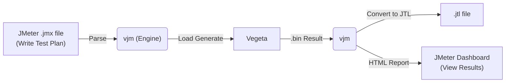

<p align="center">
  
</p>

<h1 align="center">⚡ vjm — Vegeta-JMeter Engine</h1>

<p align="center">
  <b>Harness the power of Vegeta with your JMeter Test Plans.</b><br>
  Write with JMeter. Attack with Vegeta. Report with JMeter.
</p>

<p align="center">
  <a href="https://github.com/xvlet/vjm"></a>
  <a href="https://github.com/xvlet/vjm/blob/main/LICENSE"></a>
  
  
  
  <a href="README.ko-KR.md"></a>
</p>

---

## Overview

**vjm** is a **bridge engine** that allows you to utilize [Apache JMeter](https://jmeter.apache.org/)'s `.jmx` test plans and reporting capabilities while executing the actual HTTP load generation using the high-performance Go-based tool, [Vegeta](https://github.com/tsenart/vegeta).

While JMeter is a powerful tool for writing test scenarios, its JVM-based nature limits its performance under massive concurrent connections. `vjm` overcomes this limitation by preserving JMeter's rich ecosystem (GUI, functions, reports) while stably generating thousands of TPS using the Vegeta engine.



---

## Key Features

<table>
<tr><td><b>JMX Parsing</b></td><td>Supports parsing of HTTPSamplerProxy, HeaderManager, ThreadGroup, UserDefinedVariables, UserParameters, and HTTP Request Defaults (ConfigTestElement) in JMeter <code>.jmx</code> files.</td></tr>
<tr><td><b>JMeter Function Evaluation</b></td><td>Supports built-in functions like <code>${__time(...)}</code>, <code>${__RandomString(...)}</code>, <code>${__P(...)}</code>, <code>${__eval(...)}</code>, <code>${__FileToString(...)}</code>, etc.</td></tr>
<tr><td><b>Vegeta-based Load Generation</b></td><td>Utilizes the Vegeta engine, capable of handling thousands of TPS. Precise control via <code>-r</code> (Rate), <code>-d</code> (Duration), and <code>-w</code> (Workers) parameters.</td></tr>
<tr><td><b>Automatic JTL Conversion</b></td><td>Automatically converts Vegeta's binary results (<code>.bin</code>) into JMeter-readable CSV JTL format.</td></tr>
<tr><td><b>JMeter HTML Reports</b></td><td>Automatically generates JMeter dashboard HTML reports using the converted JTL.</td></tr>
<tr><td><b>Report-Only Mode</b></td><td>Regenerate reports independently at any time using existing <code>.bin</code> or <code>.jtl</code> files.</td></tr>
<tr><td><b>Single Binary Distribution</b></td><td>CGO disabled, no external library dependencies. Supports cross-compilation for Linux, macOS, Windows (amd64, arm64) and AIX (ppc64).</td></tr>
<tr><td><b>.properties File Support</b></td><td>Easily manage environment-specific parameters by specifying multiple JMeter-style <code>.properties</code> files.</td></tr>
</table>

---

## Unsupported JMeter Features (Architectural Limitations)

Because `vjm` translates JMeter's **Thread-based, sequential state** model into Vegeta's **Rate-based, stateless** model, certain JMeter elements that rely heavily on per-thread flow control or inter-request state are inherently unsupported or only partially supported:

*   **Complex Logic Controllers (e.g., If, While, Loop, ForEach)**: Vegeta fires predefined targets continuously. It cannot conditionally branch or loop dynamically based on the outcome of a previous request within a single worker's flow.
*   **JVM-Dependent Elements (e.g., JSR223, BeanShell, JDBC)**: `vjm` is a native Go application and does not embed a Java Virtual Machine. Elements requiring Java script execution or JDBC drivers are not supported.

*(Note: Essential stateful features like Extractors, HTTP Cookie Manager, Timers, and Assertions **ARE** fully supported via `vjm`'s internal engine enhancements.)*

---

## Prerequisites

`vjm` is a statically compiled Go binary with **no external dependencies required** to run a load test.

| Tool | Purpose | Installation Check |
|------|---------|-------------------|
| [Apache JMeter](https://jmeter.apache.org/) | HTML report generation (Optional) | `$JMETER_HOME/bin/jmeter -v` |

> **Note:** JMeter is only required when generating HTML reports (`-e` option). It is not needed to execute the load test itself. Vegeta is embedded directly into the `vjm` engine.

---

## Installation

You can install `vjm` using one of the following methods. The `vjm` binary is distributed as a statically linked executable (`CGO_ENABLED=0`), ensuring it runs independently without any external dependency issues.

### 1. Using Go (go install)
If you have Go (1.25+) installed, you can easily install `vjm` via `go install`:
```bash
go install github.com/xvlet/vjm/cmd/vjm@latest
```

### 2. Download Pre-built Binary
If you don't have Go installed and just want to use the executable, download the latest pre-built release.
- [Download binary from Releases](https://github.com/xvlet/vjm/releases)

After downloading, extract the archive and run it:
```bash
tar -xzf vjm_linux_amd64.tar.gz
chmod +x vjm
./vjm -h
```

---

## Build

```bash
git clone https://github.com/xvlet/vjm.git
cd vjm

# Build for specific platform (e.g., Linux amd64)
make linux_amd64

# Other available targets:
# linux_arm64, darwin_amd64, darwin_arm64, windows_amd64, windows_arm64, aix_ppc64

# Build all supported platforms
make all

# Check build outputs
ls build/
# vjm_linux_amd64.tar.gz   vjm_windows_amd64.zip   ...
```

### Manual Build

```bash
# Linux
GOOS=linux GOARCH=amd64 CGO_ENABLED=0 go build -ldflags="-w -s" -o vjm ./cmd/vjm/main.go

# AIX (PowerPC)
GOOS=aix GOARCH=ppc64 GOPPC64=power8 CGO_ENABLED=0 go build -ldflags="-w" -o vjm_aix ./cmd/vjm/main.go
```

---

## Quick Start

### 1. Run a Load Test

```bash
# Basic run: Specify JMX file, 3000 TPS, 60 seconds, max 200 workers
./vjm -t my_test.jmx -r 3000 -d 60s -w 200

# Inject environment parameters by loading multiple properties files
./vjm -t my_test.jmx \
      -p common.properties \
      -p headers.properties \
      -r 5000 -d 30s -w 300

# Specify custom result file path
./vjm -t my_test.jmx -r 1000 -d 10s -l ./results/my_result.bin

# Force CLI rate, duration, and worker options, ignoring JMX Thread Group configuration
# (e.g., Useful for overriding Stepping Thread Group scenarios to forcefully apply CLI options)
./vjm -t my_test.jmx -r 2000 -d 30s -w 100 -f
```

### 2. Run Load Test + Generate HTML Report

```bash
./vjm -t my_test.jmx \
      -p common.properties \
      -r 3000 -d 60s -w 200 \
      -e ./html-report
```

After execution, check the JMeter dashboard at `./html-report/report_<timestamp>/index.html`.

### 3. Generate Report from Existing Results

If you already have a `.bin` or `.jtl` file, you can generate a report without running a load test.

```bash
# Convert .bin to JTL + Generate HTML report
./vjm -g results/result_20260701_110632.bin -e ./html-report

# If you already have a .jtl file: Skip JTL conversion, generate report only
./vjm -g results/result_20260701_110632.jtl -e ./html-report
```

---

## Options Reference

```text
Usage: vjm -t <plan.jmx> [-p props.properties] -r 3000 -d 60s
       vjm -g <result.bin|result.jtl> -e <report_dir>

Options:
  -t string
        Path to JMeter .jmx file (Required for load testing mode)

  -r, -rate int
        Requests per second (TPS). Default: 1000

  -d, -duration string
        Test duration. e.g., 30s, 1m, 5m. Default: 30s

  -w, -workers int
        Max concurrent workers. 0 means use default (10000)

  -p string
        Path to .properties file. Can be specified multiple times
        e.g., -p common.properties -p headers.properties

  -l string
        Path to save the result binary (.bin).
        Default: results/result_YYYYMMDD_HHMMSS.bin

  -e, -export string
        HTML report output directory.
        Reports are generated under <dir>/report_<timestamp>/

  -g, -report-only string
        Generate a report from an existing .bin or .jtl file.
        Must be used with the -e option

  -f, -force-cli
        Force CLI rate and duration, ignoring JMX Thread Group configuration (like Stepping configurations).

  -jmeter-home string
        JMETER_HOME path. Automatically references the $JMETER_HOME environment variable
```

---

## Output File Structure

After running a test, the following files are generated:

```text
results/
├── result_20260701_110632.bin    # Vegeta binary result (original)
└── result_20260701_110632.jtl    # JMeter-compatible CSV (JTL format)

html-report/
└── report_20260701_110632/
    ├── index.html                # JMeter Dashboard Main Page
    ├── content/
    │   ├── pages/                # Detailed statistics pages
    │   └── js/                   # Chart data
    └── sbadmin2-1.0.7/           # Dashboard CSS/JS
```

---

## .properties File Format

Uses the standard JMeter properties file format.

```properties
# common.properties
target.host=127.0.0.1
target.port=9998
target.path=/api/v1/testapi

# Referenced in JMeter functions as ${__P(target.host)}
```

```properties
# headers.properties
http-header-name1=HEADER-DATA-1
someheader=somedata
testdata=test
```

---

## JMeter Function Support

Evaluates standard JMeter functions used within the `.jmx` file.

| Function | Description | Example |
|----------|-------------|---------|
| `${__time(format)}` | Current time. If no args, returns Unix ms | `${__time(yyyyMMdd)}` |
| `${__RandomString(len,chars)}` | Generates a random string | `${__RandomString(10,ABC123)}` |
| `${__P(key,default)}` | References a properties value | `${__P(target.host,localhost)}` |
| `${__eval(expr)}` | Re-evaluates an expression | `${__eval(${myVar})}` |
| `${__FileToString(path)}` | Loads file contents as a string | `${__FileToString(body.json)}` |
| `${__UUID()}` | Generates a UUID v4 | `${__UUID()}` |
| `${__property(key,var,def)}` | References a property (can be saved) | `${__property(target.host,MYVAR,localhost)}` |
| `${__V(varName,def)}` | Evaluates a variable name | `${__V(A_${N})}` |
| `${__Random(min,max,var)}` | Generates a random integer | `${__Random(1,100,MYVAR)}` |
| `${__intSum(a,b,var)}` | Adds multiple integers | `${__intSum(2,5,MYVAR)}` |
| `${__longSum(a,b,var)}` | Adds multiple long integers | `${__longSum(2,5,MYVAR)}` |
| `${__urlencode(str)}` | URL encodes a string | `${__urlencode(${myVar})}` |
| `${__urldecode(str)}` | URL decodes a string | `${__urldecode(${myVar})}` |
| `${__toLowerCase(str,var)}` | Converts string to lowercase | `${__toLowerCase(HELLO)}` |
| `${__toUpperCase(str,var)}` | Converts string to uppercase | `${__toUpperCase(hello)}` |
| `${__escapeHtml(str)}` | Escapes HTML characters | `${__escapeHtml(<b>Test</b>)}` |
| `${__unescapeHtml(str)}` | Unescapes HTML characters | `${__unescapeHtml(&lt;b&gt;Test&lt;/b&gt;)}` |
| `${__machineIP()}` | Returns local IP address | `${__machineIP()}` |
| `${__machineName()}` | Returns local host name | `${__machineName()}` |
| `${__md5(str,var)}` | Computes MD5 hash | `${__md5(hello)}` |
| `${__digest(algo,str,salt,upper,var)}` | Computes hash (MD5, SHA-1, SHA-256, SHA-512) | `${__digest(SHA-256,hello)}` |
| `${__split(str,var,delim)}` | Splits string into variables | `${__split(a\,b\,c,MYVAR,\,)}` |
| `${__dateTimeConvert(date,src,tgt,var)}` | Converts date format | `${__dateTimeConvert(01012026,ddMMyyyy,yyyy-MM-dd)}` |
| `${__substring(str,begin,end,var)}` | Returns substring | `${__substring(hello,0,2)}` |
| `${__isPropDefined(key)}` | Tests if property exists | `${__isPropDefined(target)}` |
| `${__isVarDefined(var)}` | Tests if variable exists | `${__isVarDefined(MYVAR)}` |
| `${__setProperty(key,val,ret)}` | Sets property value | `${__setProperty(target,localhost,false)}` |
| `${__counter(TRUE/FALSE,var)}` | Global or per-thread counter | `${__counter(FALSE,MYVAR)}` |
| `${__CSVRead(file,col|next)}` | Reads CSV column | `${__CSVRead(test.csv,0)}` |
| `${__evalVar(var)}` | Evaluates expression in variable | `${__evalVar(MYVAR)}` |
| `${__changeCase(str,mode,var)}` | Changes case (UPPER/LOWER/CAPITALIZE) | `${__changeCase(hello,UPPER)}` |
| `${__char(num...)}` | Generates Unicode char from number | `${__char(0x41)}` |
| `${__XPath(file,expr)}` | Use an XPath expression to read from a file | `${__XPath(data.xml,//node)}` |
| `${varName}` | Variable reference | `${target.host}` |

---

## Architecture

```text
cmd/vjm/
└── main.go                  # CLI entrypoint, flag parsing

internal/
├── domain/
│   ├── entity.go            # TestConfig, RequestTemplate domain models
│   └── plan.go              # TestPlan, ThreadGroup, Sampler domain models
│
├── evaluator/
│   ├── evaluator.go         # Evaluator interface
│   └── jmeter_evaluator.go  # JMeter function/variable evaluator implementation
│
├── infra/
│   ├── parser/
│   │   └── jmx_parser.go    # JMX XML parser (SAX style streaming)
│   ├── vegeta/
│   │   └── runner.go        # Vegeta process execution and streaming target provider
│   └── jmeter/
│       └── reporter.go      # Vegeta CSV → JTL conversion / JMeter report invocation
│
└── usecase/
    ├── interfaces.go        # Port interfaces (StressTestUsecase, JmxParser, etc.)
    └── orchestrator.go      # Usecase implementation (Execute, GenerateReportOnly)
```

---

## AIX Environment Execution

Execution tips for the AIX PowerPC environment.

```bash
# asyncpreemptoff=1: Stabilizes AIX signal handling in older Go versions
GODEBUG=asyncpreemptoff=1 ./vjm_aix \
    -t test.jmx \
    -p common.properties \
    -r 3000 -d 60s -w 200
```

### Recommended AIX Network Tuning

For maximum performance at massive TPS, apply the following settings with root privileges.

```bash
no -p -o rfc1323=1             # Enable TCP Window Scaling
no -p -o tcp_recvspace=262144  # TCP receive buffer 256KB
no -p -o tcp_sendspace=262144  # TCP send buffer 256KB
no -p -o sb_max=4194304        # Max socket buffer 4MB
no -p -o somaxconn=8192        # Expand socket backlog queue
no -p -o tcp_ephemeral_low=10241  # Expand ephemeral port range
```

---

## Test Result Example

```text
===================================================
Vegeta Attack Report:
===================================================
Requests      [total, rate, throughput]         75326, 7532.26, 7506.49
Duration      [total, attack, wait]             10.035s, 10s, 34.332ms
Latencies     [min, mean, 50, 90, 95, 99, max]  1.839ms, 51.648ms, 49.853ms, 77.117ms, 86.962ms, 110.445ms, 208.217ms
Bytes In      [total, mean]                     63424492, 842.00
Bytes Out     [total, mean]                     63424492, 842.00
Success       [ratio]                           100.00%
Status Codes  [code:count]                      200:75326
Error Set:
===================================================
```

---

## Roadmap

### Key Milestones
- [x] **SteppingThreadGroup Support**: Implement JMeter's stepped load increase scenarios
- [x] **Multi-Sampler Support**: Handle multiple HTTPSamplers within a ThreadGroup based on weights
- [x] **Stateful Variable Chaining (Extractors)**: Support sequential scenarios by extracting values from previous responses and injecting them into subsequent requests
- [x] **JMeter CSV DataSet Support**: Inject different parameters per request from a `CSVDataSet`
- [ ] **WebSocket Support**: Integrate WS protocol load testing
- [x] **Real-time Console Dashboard**: Real-time TPS / response time monitoring during tests

### Thread Group Support
- [x] **Thread Group** (Standard)
- [x] **jp@gc - Stepping Thread Group**
- [x] **Open Model Thread Group**
- [x] **bzm - Concurrency Thread Group**
- [x] **jp@gc - Ultimate Thread Group**
- [x] **bzm - Arrivals Thread Group**
- [x] **bzm - Free-Form Arrivals Thread Group**
- [x] **setUp Thread Group**
- [x] **tearDown Thread Group**

### Logic Controllers
- [x] **If Controller**
- [ ] **Transaction Controller**
- [ ] **Loop Controller**
- [ ] **While Controller**
- [ ] **Critical Section Controller**
- [ ] **ForEach Controller**
- [ ] **Include Controller**
- [ ] **Interleave Controller**
- [ ] **Once Only Controller**
- [ ] **Random Controller**
- [ ] **Random Order Controller**
- [ ] **Recording Controller**
- [ ] **Runtime Controller**
- [ ] **Simple Controller**
- [x] **Throughput Controller**
- [ ] **Module Controller**
- [ ] **Switch Controller**

### Config Elements
- [x] **HTTP Header Manager**
- [x] **HTTP Request Defaults**
- [x] **User Defined Variables**
- [x] **CSV Data Set Config**
- [x] **HTTP Cookie Manager**
- [x] **HTTP Cache Manager**
- ~~[ ] **Bolt Connection Configuration**~~ (Excluded - JVM dependent)
- [x] **Counter**
- [x] **DNS Cache Manager**
- ~~[ ] **FTP Request Defaults**~~ (Excluded - Non HTTP)
- [x] **HTTP Authorization Manager**
- ~~[ ] **JDBC Connection Configuration**~~ (Excluded - JVM dependent)
- ~~[ ] **Java Request Defaults**~~ (Excluded - JVM dependent)
- ~~[ ] **Keystore Configuration**~~ (Excluded - JVM dependent)
- ~~[ ] **LDAP Extended Request Defaults**~~ (Excluded - JVM dependent)
- ~~[ ] **LDAP Request Defaults**~~ (Excluded - JVM dependent)
- ~~[ ] **Login Config Element**~~ (Excluded - Non HTTP)
- [x] **Random Variable**
- [ ] **Simple Config Element**
- ~~[ ] **TCP Sampler Config**~~ (Excluded - Non HTTP)

### Listeners
- [x] **View Results Tree** (File output only)
- [x] **Summary Report** (File output only)
- [x] **Aggregate Report** (File output only)
- [x] **Backend Listener** (Parsed, DB logic pending)
- [x] **Aggregate Graph** (File output only)
- [ ] **Assertion Results**
- [ ] **Comparison Assertion Visualizer**
- [ ] **Generate Summary Results**
- [ ] **Graph Results**
- [ ] **JSR223 Listener**
- [ ] **Mailer Visualizer**
- [ ] **Response Time Graph**
- [ ] **Save Responses to a file**
- [ ] **Simple Data Writer**
- [ ] **View Results in Table**
- [ ] **BeanShell Listener**

### Timers
- [x] **Constant Timer**
- [x] **Uniform Random Timer**
- [x] **Precise Throughput Timer** (Mapped to Vegeta Pacer)
- [x] **Constant Throughput Timer** (Mapped to Vegeta Pacer)
- [x] **Gaussian Random Timer**
- ~~[ ] **JSR223 Timer**~~ (Excluded - JVM dependent script)
- [x] **Poisson Random Timer**
- [x] **Synchronizing Timer**
- ~~[ ] **BeanShell Timer**~~ (Excluded - JVM dependent script)

### Pre Processors
- [x] **User Parameters**
- [ ] **JSR223 PreProcessor**
- [ ] **HTML Link Parser**
- [ ] **HTTP URL Re-writing Modifier**
- [ ] **JDBC PreProcessor**
- [ ] **RegEx User Parameters**
- [ ] **Sample Timeout**
- [ ] **BeanShell PreProcessor**

### Post Processors
- [x] **JSON Extractor**
- [x] **Regular Expression Extractor**
- [ ] **CSS Selector Extractor**
- [ ] **JSON JMESPath Extractor**
- [ ] **Boundary Extractor**
- [ ] **JSR223 PostProcessor**
- [ ] **Debug PostProcessor**
- [ ] **JDBC PostProcessor**
- [ ] **Result Status Action Handler**
- [ ] **XPath Extractor**
- [ ] **XPath2 Extractor**
- [ ] **BeanShell PostProcessor**

### Assertions
- [x] **Response Assertion**
- [x] **JSON Assertion**
- [ ] **Size Assertion**
- [ ] **JSR223 Assertion**
- [ ] **XPath Assertion**
- [ ] **Compare Assertion**
- [ ] **Duration Assertion**
- [ ] **HTML Assertion**
- [ ] **MD5Hex Assertion**
- [ ] **SMIME Assertion**
- [ ] **XML Assertion**
- [ ] **XML Schema Assertion**
- [ ] **XPath2 Assertion**
- [ ] **BeanShell Assertion**

### Test Fragment
- [ ] **Test Fragment**

### Non-Test Elements
- [ ] **HTTP Mirror Server**
- [ ] **HTTP(S) Test Script Recorder**
- [ ] **Property Display**

---

## License

MIT License — see [LICENSE](LICENSE) for details.

---

<p align="center">
  <b>vjm</b> — Write with JMeter. Attack with Vegeta. ⚡
</p>
