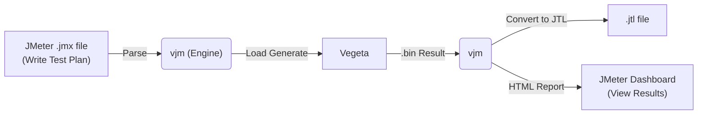

<p align="center">
  
</p>

<h1 align="center">⚡ vjm — Vegeta-JMeter Engine</h1>

<p align="center">
  <b>Harness the immense power of Vegeta with your JMeter Test Plans.</b><br>
  Write with JMeter. Attack with Vegeta. Report with JMeter.
</p>

<p align="center">
  <a href="https://github.com/xvlet/vjm"></a>
  <a href="https://github.com/xvlet/vjm/blob/main/LICENSE"></a>
  
  
  
  <a href="README.ko-KR.md"></a>
</p>

---

## Overview

**vjm** is a **bridge engine** that allows you to utilize [Apache JMeter](https://jmeter.apache.org/)'s `.jmx` test plans and reporting capabilities while executing the actual HTTP load generation using the high-performance Go-based tool, [Vegeta](https://github.com/tsenart/vegeta).

While JMeter is a powerful tool for writing test scenarios, its JVM-based nature limits its performance under massive concurrent connections. `vjm` overcomes this limitation by preserving JMeter's rich ecosystem (GUI, functions, reports) while stably generating thousands of TPS using the Vegeta engine.



---

## Key Features

<table>
<tr><td><b>🗂️ Full JMX Parsing</b></td><td>Supports parsing of HTTPSamplerProxy, HeaderManager, ThreadGroup, UserDefinedVariables, UserParameters, and HTTP Request Defaults (ConfigTestElement) in JMeter <code>.jmx</code> files.</td></tr>
<tr><td><b>🔧 JMeter Function Evaluation</b></td><td>Supports built-in functions like <code>${__time(...)}</code>, <code>${__RandomString(...)}</code>, <code>${__P(...)}</code>, <code>${__eval(...)}</code>, <code>${__FileToString(...)}</code>, etc.</td></tr>
<tr><td><b>⚡ Vegeta-based Load Generation</b></td><td>Utilizes the Vegeta engine, capable of handling thousands of TPS. Precise control via <code>-r</code> (Rate), <code>-d</code> (Duration), and <code>-w</code> (Workers) parameters.</td></tr>
<tr><td><b>📊 Automatic JTL Conversion</b></td><td>Automatically converts Vegeta's binary results (<code>.bin</code>) into JMeter-readable CSV JTL format.</td></tr>
<tr><td><b>📋 JMeter HTML Reports</b></td><td>Automatically generates JMeter dashboard HTML reports using the converted JTL.</td></tr>
<tr><td><b>🔁 Report-Only Mode</b></td><td>Regenerate reports independently at any time using existing <code>.bin</code> or <code>.jtl</code> files.</td></tr>
<tr><td><b>📦 Single Binary Distribution</b></td><td>CGO disabled, no external library dependencies. Supports cross-compilation for Linux (amd64) and AIX (ppc64).</td></tr>
<tr><td><b>🧩 .properties File Support</b></td><td>Easily manage environment-specific parameters by specifying multiple JMeter-style <code>.properties</code> files.</td></tr>
</table>

---

## Prerequisites

The following tools must be installed on the machine running `vjm`.

| Tool | Purpose | Installation Check |
|------|---------|-------------------|
| [Vegeta](https://github.com/tsenart/vegeta) | HTTP load generation engine | `vegeta -version` |
| [Apache JMeter](https://jmeter.apache.org/) | HTML report generation (Optional) | `$JMETER_HOME/bin/jmeter -v` |

```bash
# Example: Installing Vegeta (Linux)
go install github.com/tsenart/vegeta@latest

# Or download the binary directly from GitHub Releases
# https://github.com/tsenart/vegeta/releases
```

> **Note:** JMeter is only required when generating HTML reports (`-e` option). It is not needed to execute the load test itself.

---

## Build

```bash
git clone https://github.com/xvlet/vjm.git
cd vjm

# Build for Linux (amd64)
make linux

# Cross-compile for AIX (ppc64)
make aix

# Build all (Linux + AIX)
make all

# Check build outputs
ls build/
# vjm_linux   vjm_aix
```

### Manual Build

```bash
# Linux
GOOS=linux GOARCH=amd64 CGO_ENABLED=0 go build -ldflags="-w -s" -o vjm ./cmd/vjm/main.go

# AIX (PowerPC)
GOOS=aix GOARCH=ppc64 GOPPC64=power8 CGO_ENABLED=0 go build -ldflags="-w" -o vjm_aix ./cmd/vjm/main.go
```

---

## Quick Start

### 1. Run a Load Test

```bash
# Basic run: Specify JMX file, 3000 TPS, 60 seconds, max 200 workers
./vjm -t my_test.jmx -r 3000 -d 60s -w 200

# Inject environment parameters by loading multiple properties files
./vjm -t my_test.jmx \
      -p common.properties \
      -p headers.properties \
      -r 5000 -d 30s -w 300

# Specify custom result file path
./vjm -t my_test.jmx -r 1000 -d 10s -l ./results/my_result.bin
```

### 2. Run Load Test + Generate HTML Report

```bash
./vjm -t my_test.jmx \
      -p common.properties \
      -r 3000 -d 60s -w 200 \
      -e ./html-report
```

After execution, check the JMeter dashboard at `./html-report/report_<timestamp>/index.html`.

### 3. Generate Report from Existing Results

If you already have a `.bin` or `.jtl` file, you can generate a report without running a load test.

```bash
# Convert .bin to JTL + Generate HTML report
./vjm -g results/result_20260701_110632.bin -e ./html-report

# If you already have a .jtl file: Skip JTL conversion, generate report only
./vjm -g results/result_20260701_110632.jtl -e ./html-report
```

---

## Options Reference

```text
Usage: vjm -t <plan.jmx> [-p props.properties] -r 3000 -d 60s
       vjm -g <result.bin|result.jtl> -e <report_dir>

Options:
  -t string
        Path to JMeter .jmx file (Required for load testing mode)

  -r, -rate int
        Requests per second (TPS). Default: 1000

  -d, -duration string
        Test duration. e.g., 30s, 1m, 5m. Default: 30s

  -w, -workers int
        Max concurrent workers. 0 means use Vegeta's default

  -p string
        Path to .properties file. Can be specified multiple times
        e.g., -p common.properties -p headers.properties

  -l string
        Path to save the result binary (.bin).
        Default: results/result_YYYYMMDD_HHMMSS.bin

  -e, -export string
        HTML report output directory.
        Reports are generated under <dir>/report_<timestamp>/

  -g, -report-only string
        Generate a report from an existing .bin or .jtl file.
        Must be used with the -e option

  -jmeter-home string
        JMETER_HOME path. Automatically references the $JMETER_HOME environment variable
```

---

## Output File Structure

After running a test, the following files are generated:

```text
results/
├── result_20260701_110632.bin    # Vegeta binary result (original)
└── result_20260701_110632.jtl    # JMeter-compatible CSV (JTL format)

html-report/
└── report_20260701_110632/
    ├── index.html                # JMeter Dashboard Main Page
    ├── content/
    │   ├── pages/                # Detailed statistics pages
    │   └── js/                   # Chart data
    └── sbadmin2-1.0.7/           # Dashboard CSS/JS
```

---

## .properties File Format

Uses the standard JMeter properties file format.

```properties
# common.properties
target.host=127.0.0.1
target.port=9998
target.path=/api/v1/testapi

# Referenced in JMeter functions as ${__P(target.host)}
```

```properties
# headers.properties
http-header-name1=HEADER-DATA-1
someheader=somedata
testdata=test
```

---

## JMeter Function Support

Evaluates standard JMeter functions used within the `.jmx` file.

| Function | Description | Example |
|----------|-------------|---------|
| `${__time(format)}` | Current time. If no args, returns Unix ms | `${__time(yyyyMMdd)}` |
| `${__RandomString(len,chars)}` | Generates a random string | `${__RandomString(10,ABC123)}` |
| `${__P(key,default)}` | References a properties value | `${__P(target.host,localhost)}` |
| `${__eval(expr)}` | Re-evaluates an expression | `${__eval(${myVar})}` |
| `${__FileToString(path)}` | Loads file contents as a string | `${__FileToString(body.json)}` |
| `${varName}` | Variable reference | `${target.host}` |

---

## Architecture

```text
cmd/vjm/
└── main.go                  # CLI entrypoint, flag parsing

internal/
├── domain/
│   ├── entity.go            # TestConfig, RequestTemplate domain models
│   └── plan.go              # TestPlan, ThreadGroup, Sampler domain models
│
├── evaluator/
│   ├── evaluator.go         # Evaluator interface
│   └── jmeter_evaluator.go  # JMeter function/variable evaluator implementation
│
├── infra/
│   ├── parser/
│   │   └── jmx_parser.go    # JMX XML parser (SAX style streaming)
│   ├── vegeta/
│   │   └── runner.go        # Vegeta process execution and streaming target provider
│   └── jmeter/
│       └── reporter.go      # Vegeta CSV → JTL conversion / JMeter report invocation
│
└── usecase/
    ├── interfaces.go        # Port interfaces (StressTestUsecase, JmxParser, etc.)
    └── orchestrator.go      # Usecase implementation (Execute, GenerateReportOnly)
```

---

## AIX Environment Execution

Execution tips for the AIX PowerPC environment.

```bash
# asyncpreemptoff=1: Stabilizes AIX signal handling in older Go versions
GODEBUG=asyncpreemptoff=1 ./vjm_aix \
    -t test.jmx \
    -p common.properties \
    -r 3000 -d 60s -w 200
```

### Recommended AIX Network Tuning

For maximum performance at massive TPS, apply the following settings with root privileges.

```bash
no -p -o rfc1323=1             # Enable TCP Window Scaling
no -p -o tcp_recvspace=262144  # TCP receive buffer 256KB
no -p -o tcp_sendspace=262144  # TCP send buffer 256KB
no -p -o sb_max=4194304        # Max socket buffer 4MB
no -p -o somaxconn=8192        # Expand socket backlog queue
no -p -o tcp_ephemeral_low=10241  # Expand ephemeral port range
```

---

## Test Result Example

```text
===================================================
Vegeta Attack Report:
===================================================
Requests      [total, rate, throughput]         75326, 7532.26, 7506.49
Duration      [total, attack, wait]             10.035s, 10s, 34.332ms
Latencies     [min, mean, 50, 90, 95, 99, max]  1.839ms, 51.648ms, 49.853ms, 77.117ms, 86.962ms, 110.445ms, 208.217ms
Bytes In      [total, mean]                     63424492, 842.00
Bytes Out     [total, mean]                     63424492, 842.00
Success       [ratio]                           100.00%
Status Codes  [code:count]                      200:75326
Error Set:
===================================================
```

---

## Roadmap

- [ ] **SteppingThreadGroup Support**: Implement JMeter's stepped load increase scenarios
- [ ] **Multi-Sampler Support**: Handle multiple HTTPSamplers within a ThreadGroup based on weights
- [ ] **JMeter CSV DataSet Support**: Inject different parameters per request from a `CSVDataSet`
- [ ] **WebSocket Support**: Integrate WS protocol load testing
- [ ] **Real-time Console Dashboard**: Real-time TPS / response time monitoring during tests

---

## License

MIT License — see [LICENSE](LICENSE) for details.

---

<p align="center">
  <b>vjm</b> — Write with JMeter. Attack with Vegeta. ⚡
</p>
